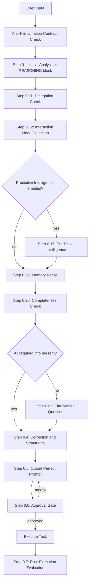

# Prompt Perfection Core Library

**Version:** 2.0
**Last Updated:** 2026-04-07
**Purpose:** Canonical Phase 0 implementation for all prompt commands
**AI Fluency:** Aligned with Anthropic's 4Ds Framework (Delegation, Description, Discernment, Diligence)

**Import Syntax:** Reference this file using @.claude/library/prompt-perfection-core.md

---

## Anti-Hallucination Contract

**HARD-GATE: These rules apply unconditionally to every skill using this library.**

### NEVER
- State the project version without reading `project-profile.md` in this session
- Assume a file exists without verifying with Read or Glob
- Invent file paths, class names, function names, or config keys
- State tech stack without reading `project-profile.md` or the project's manifest file
- Copy example values from instruction templates into actual output as if they were real facts

### ALWAYS
- Ground every stated fact: note which file you read it from in this session
- If a file does not exist: explicitly state "File not found — proceeding without it"
- If uncertain about any fact: ask the user, do not guess

### Grounding Protocol
Before any output containing project facts:
1. List files read in this session
2. Map each stated fact to its source file
3. Flag any fact without a source as "UNVERIFIED — asking user"

---

## Overview

This library defines the **universal Phase 0 flow** for transforming any user input into a perfect, unambiguous prompt that Claude Code can execute without guessing.

All prompt commands should use this library as their foundation, with optional domain-specific adaptations.

---

## Phase 0 Flowchart



---

## How to Use This Library

### In Your Slash Command

Add this reference at the beginning of your command file:

```markdown
## Phase 0: Prompt Perfection

**Import:** Use the canonical Phase 0 flow from `.claude/library/prompt-perfection-core.md`

**Adaptation:** [None | Technical | Article | Session | Custom]

**Domain-Specific Criteria:** [If applicable, list additional criteria]
```

When Claude reads your command, it will:
1. Load this library's Phase 0 definition
2. Apply any domain-specific adaptations you specify
3. Execute the perfected flow consistently

---

## The Canonical Phase 0 Flow

### Step 0.1: Initial Analysis

**Purpose:** Understand what the user wants

**Actions:**
1. **Detect language:** Slovak / English / Other
2. **Identify prompt type:**
   - Task (implementation work)
   - Question (information request)
   - Bug Fix (problem resolution)
   - Explanation (understanding codebase)
   - Code Review (quality assessment)
   - Refactoring (code improvement)
   - Content Creation (writing/documentation)
   - Session Management (context saving/loading)
   - Other (specify)
3. **Extract core intent:** What does the user ultimately want to achieve?

**Output Format:**
```markdown
**Phase 0: Prompt Perfection**

**Detected Language:** [language]
**Prompt Type:** [type]
**Core Intent:** [one sentence summary]

**Original Input:**
> [user's exact words]
```

**Required REASONING Block (output before proceeding to Step 0.11):**

```
REASONING
Prompt type selected: [type] — because [specific reason from input]
Facts from files read this session:
  - [fact 1] — source: [filename]
  - [fact 2] — source: [filename]
Facts I cannot determine without asking: [list or "none"]
```

---

### Step 0.11: Quick Delegation Check *(AI Fluency - NEW v1.4)*

**Purpose:** Verify this task is appropriate for AI before proceeding

**Based on Anthropic's AI Fluency Framework - Delegation Competency:**

**Quick Assessment (3 checks):**

1. **Task Appropriateness:**
   - Is this task suitable for AI assistance?
   - Does it require human-only judgment (ethics, policy, irreversible decisions)?

2. **AI Capability Match:**
   - Does this match AI strengths (code analysis, text generation, pattern detection)?
   - Or does it exceed AI limitations (recent events, complex math, personal decisions)?

3. **Responsibility Awareness:**
   - Does the user understand they remain responsible for the output?
   - Are there safety/security implications requiring human oversight?

**Decision Logic:**
```
IF task requires ONLY human judgment (ethics, policy, personal):
    → Flag: "This requires human decision. I can help analyze, but you must decide."
    → Proceed with advisory mode

IF task involves irreversible actions (delete, deploy, publish):
    → Flag: "⚠️ Irreversible action detected. Requires explicit confirmation."
    → Add extra confirmation step

IF task matches AI strengths AND user accepts responsibility:
    → Proceed to Step 0.12

IF uncertain about appropriateness:
    → Ask: "This task involves [X]. Should I proceed with AI assistance, or would you prefer to handle this yourself?"
```

**Output (only when flags triggered):**
```markdown
**⚠️ Delegation Check:**
- Task Type: [Type]
- AI Appropriate: [Yes / Partial / Advisory Only]
- Note: [Any flags or concerns]
- Proceed? [Waiting for confirmation if flagged]
```

**Note:** For most tasks, this check passes silently. Only surface when concerns exist.

---

### Step 0.12: Interaction Mode Detection *(AI Fluency - NEW v1.3)*

**Purpose:** Determine the optimal human-AI collaboration mode for this task

**Based on Anthropic's AI Fluency Framework, detect one of three modes:**

**Automation Mode:**
- AI performs specific tasks based on specific human instructions
- Human defines WHAT, AI executes
- Best for: Simple tasks, clear instructions, single-file changes
- Indicators: "Fix X", "Add Y to Z", "Change A to B"

**Augmentation Mode:**
- Human and AI collaborate as thinking partners
- Iterative back-and-forth where both contribute
- Best for: Complex analysis, design decisions, problem-solving
- Indicators: "Help me understand", "What's the best approach", "Let's figure out"

**Agency Mode:**
- Human configures AI to work independently
- AI establishes knowledge and behavior patterns
- Best for: Research tasks, codebase exploration, multi-agent work
- Indicators: "Research X", "Explore the codebase", "Find all instances"

**Detection Logic:**
```
IF prompt contains direct commands AND clear scope:
    → Automation Mode
ELSE IF prompt requests collaboration OR decision-making:
    → Augmentation Mode
ELSE IF prompt requests independent research OR exploration:
    → Agency Mode
DEFAULT:
    → Augmentation Mode (most flexible)
```

**Output Format:**
```markdown
**Interaction Mode:** [Automation / Augmentation / Agency]
**Rationale:** [Why this mode fits the task]
**Implications:**
- [How AI will approach the task in this mode]
```

**Mode-Specific Adjustments:**
- **Automation:** Skip optional questions, execute directly
- **Augmentation:** Engage in dialogue, offer options, iterate
- **Agency:** Spawn agents if needed, work independently, report back

---

### Step 0.15: Predictive Intelligence (OPTIONAL - NEW v4.0)

**Purpose:** Provide proactive guidance and anticipate user needs BEFORE asking for missing information

**When to use:** When predictive intelligence is enabled in configuration

**Import:** Use Predictive Intelligence from `.claude/library/intelligence/predictive-intelligence-core.md`

**Configuration:** Check `.claude/config/predictive-intelligence.json` → `enabled`

**Process:**

IF predictive_intelligence.enabled == true:
  1. **Journey Stage Detection** - Understand where user is (exploring/implementing/debugging)
  2. **Domain Risk Analysis** - Identify security/compliance risks specific to domain
  3. **Project Pattern Recognition** - Detect existing project conventions
  4. **Relationship Mapping** - Connect to previous work and related areas
  5. **Proactive Warning System** - Warn about problems BEFORE user makes mistakes
  6. **Next-Steps Prediction** - Forecast logical followup tasks

**Output:**
```markdown
## 🔮 PREDICTIVE INTELLIGENCE ANALYSIS

[Comprehensive proactive guidance - see predictive-intelligence-core.md for full template]

**Journey Stage:** [Stage] - [Guidance]
**Domain Risks:** [Warnings and mitigations]
**Project Patterns:** [Detected conventions]
**Related Work:** [Connections to previous work]
**Proactive Warnings:** [Problems to avoid]
**Next Steps:** [Recommended followups]

---
```

**After Predictive Intelligence, continue with Step 0.2** (now enhanced with predictive context)

**Note:** This step is OPTIONAL and can be disabled in configuration. When disabled, proceed directly to Step 0.2.

---

### Step 0.2: Completeness Check

**Purpose:** Identify missing critical information, pre-filling from project memory

**Step 0.2a: Memory Recall (v1.6 - ALWAYS LOAD FIRST)**

CRITICAL: Always read project memory before asking ANY questions.
This prevents the user from having to repeat information across sessions.

1. **Read** `.claude/memory/project-profile.md` (ALWAYS - before any analysis)
2. **Read** last 3 entries from `.claude/memory/sessions.md` (for recent activity)
3. **Read** `.claude/memory/prompt-patterns.md` (for learned patterns if exists)

**If profile exists and has content (expected state):**
   - Extract ALL facts matching the 9 completeness criteria
   - Pre-fill Context, Scope, Constraints, Preferences from profile
   - Show a brief "CONTEXT LOADED" summary so user knows what is pre-filled
   - Do NOT ask any questions already answered by the profile
   - Check sessions.md for relevant recent work to mention

**If profile does not exist or is empty:**
   - Show notice: "No project profile found. I can create one to remember your project details between sessions so you never need to repeat context."
   - Ask: "Create a project profile? (yes/no)"
   - If yes: create `.claude/memory/project-profile.md` with standard headers, gather facts during Step 0.3, save to profile after
   - If no: proceed without profile

**Context Loaded Output (brief - only when profile has data):**
```
CONTEXT LOADED FROM PROJECT PROFILE
Project: [name and version]
Stack: [tech stack - brief]
Platform: [OS/environment]
Preferences: [key preferences]
Recent: [one-line summary from sessions.md if relevant]
```

**Step 0.2b: Completeness Evaluation**

**Universal Criteria (9 Components):**

Check for presence of (including pre-filled facts from memory):

**Product Description (WHAT):**
- [ ] **Goal:** Clear desired outcome (What should happen?)
- [ ] **Context:** Environment, technology, background (Where/when/why?)
- [ ] **Scope:** Specific files, components, areas (What exactly to touch?)
- [ ] **Requirements:** Specific needs or features (What must be included?)
- [ ] **Constraints:** Limitations, rules, compatibility (What to avoid/respect?)
- [ ] **Expected Result:** Success criteria (How to verify it's done?)

**Process Description (HOW):** *(AI Fluency - NEW)*
- [ ] **Approach:** Step-by-step instructions or methodology (How should AI work?)

**Performance Description (AI BEHAVIOR):** *(AI Fluency - NEW)*
- [ ] **Interaction Style:** Concise/detailed, challenging/supportive, autonomous/collaborative
- [ ] **Communication Tone:** Technical/casual, formal/conversational

**Output Format:**
```markdown
**Completeness Check:**

✅ **Present:**
- Goal: [extracted from user input]
- Context: [extracted from user input]

✅ **Present (from project profile):**
- Context: Tech stack is Node.js + PostgreSQL
- Constraints: Prefers TypeScript strict mode

❌ **Missing:**
- Scope: Need to know which files/components
- Expected Result: Need to know how to verify success

⚠️ **Optional (but recommended):**
- Constraints: [None specified]
```

**Decision Point:**
- If ALL required components present (from user input + profile) → **Go to Step 0.4 (Correction)**
- If ANY required components missing → **Go to Step 0.3 (Clarification)**

---

### Step 0.3: Clarification Questions

**Purpose:** Gather missing information without guessing, skipping what the profile already knows

**Rules:**
1. **Never assume** - Always ask when uncertain
2. **Skip known facts** - Do not ask questions already answered by the project profile
3. **Prioritize questions** - Critical first, then important, then optional
4. **Provide context** - Explain why you're asking
5. **Offer options** - When multiple valid approaches exist
6. **One round preferred** - Ask all questions together when possible

**Memory-Aware Filtering (v1.3):**
- Before asking, check if the project profile already provides the answer
- If a fact is in the profile, show it as pre-filled rather than asking
- Only ask for genuinely unknown information
- If the user opted in to a new profile (Step 0.2a), save new answers to the profile after this step

**Question Priority Levels:**

**🚨 Critical (MUST have):**
- Questions about missing Goal, Scope, or Expected Result
- Ambiguities that block execution entirely
- Safety concerns (security, data loss, breaking changes)

**⚠️ Important (SHOULD have):**
- Questions about Context that affects approach
- Missing Requirements that impact quality
- Technical feasibility concerns

**💡 Optional (NICE to have):**
- Constraints that could optimize solution
- Preferences that improve user experience
- Additional features that add value

**Output Format:**
```markdown
**Missing Information - Need Your Input:**

🚨 **Critical:**
1. [Question about essential missing component]
   - Why I'm asking: [explanation]
   - Example: [concrete example if helpful]

⚠️ **Important:**
2. [Question about helpful context]
   - Why I'm asking: [explanation]

💡 **Optional:**
3. [Question about optimizations]
   - Why I'm asking: [explanation]
   - You can skip this if not applicable
```

**Multiple Approaches Pattern:**

When multiple valid solutions exist:

```markdown
**Multiple Approaches Detected:**

I can solve this in different ways. Which approach fits your needs?

**Option 1: [Name]**
- **Description:** [What this does]
- **Pros:** [Advantages]
- **Cons:** [Disadvantages]
- **Best for:** [Use case]

**Option 2: [Name]**
- **Description:** [What this does]
- **Pros:** [Advantages]
- **Cons:** [Disadvantages]
- **Best for:** [Use case]

⭐ **Recommended:** Option [X]
**Reasoning:** [Why this is best based on context]

*Please select: 1, 2, or describe your preference*
```

**Wait for User Response:**
- Process all answers
- If new questions arise, ask them
- Repeat until all required information gathered

---

### Step 0.4: Correction & Structuring

**Purpose:** Fix errors and transform into clear, executable format

**Correction Rules:**
1. **Fix grammar and spelling** - Make it professional
2. **Preserve technical terms** - Keep code, variable names, paths EXACTLY
3. **Clarify ambiguity** - Make vague statements specific
4. **Remove redundancy** - Eliminate duplicate information
5. **Maintain intent** - Keep user's original goal and tone

**Structuring Rules:**
1. **Use active voice** - "Create a function" not "A function should be created"
2. **Be specific** - "Add validation to UserService.Login()" not "Add validation"
3. **Number requirements** - Makes them easy to reference
4. **Separate concerns** - Goal ≠ Requirements ≠ Constraints
5. **Make it actionable** - Every requirement should be testable

**Track Changes:**
Keep a list of what you changed for transparency:
```markdown
**Changes Made:**
- Fixed typo: "impliment" → "implement"
- Clarified scope: "the code" → "src/services/UserService.cs"
- Added specificity: "validation" → "email format and password strength validation"
- Removed redundancy: Combined duplicate requirement about error handling
```

---

### Step 0.5: Output Perfect Prompt

**Purpose:** Present the perfected, executable prompt

**Universal Output Format:**

```markdown
**✨ Perfected Prompt:**

**Goal:** [One clear sentence stating the desired outcome]

**Context:**
- Environment: [OS, platform, runtime]
- Technology Stack: [languages, frameworks, libraries]
- Project Background: [relevant context about the project]
- Current State: [what exists now, if relevant]

**Scope:**
- Files to modify: [list with paths]
- Files to create: [list with paths]
- Components affected: [list]
- Areas impacted: [list]

**Requirements:**
1. [First specific, testable requirement]
2. [Second specific, testable requirement]
3. [Third specific, testable requirement]
[...continue as needed]

**Constraints:**
- [Constraint 1: performance, security, compatibility]
- [Constraint 2: coding standards, patterns to follow]
- [Constraint 3: limitations to respect]
Or: *None specified*

**Expected Result:**
[Clear description of what success looks like]
- How to verify: [specific test/check]
- How to measure: [metrics if applicable]

**Discernment Hints:** *(AI Fluency - Optional)*
- **Product Evaluation:** [How to evaluate output quality - accuracy, appropriateness]
- **Process Evaluation:** [How to verify reasoning - check for logical errors]
- **Performance Evaluation:** [Communication style feedback - was it helpful?]

**Changes Made:**
- [List of corrections and improvements for transparency]
```

---

### Step 0.6: Approval Gate

**Purpose:** Get user confirmation before proceeding

**Always wait for user approval.** Never proceed automatically.

**Output Format:**
```markdown
---

⏸️ **Perfected Prompt Ready - Awaiting Your Approval**

**Summary:**
- Type: [prompt type]
- Goal: [brief goal summary]
- Scope: [scope summary]
- Confidence: [High/Medium/Low - based on completeness]

**What happens next:**
After you approve, I will [execute task / answer question / generate content / etc.]

**⚖️ Diligence Reminder (AI Fluency):**
You remain responsible for any output generated from this prompt.
- Verify key facts before deployment
- Review AI-generated code before committing
- Test thoroughly before production use

**Reply with:**
- `y` or `yes` — Execute this perfected prompt
- `n` or `no` — Cancel
- `modify [description]` — Adjust the prompt (tell me what to change)
- `explain [component]` — Explain why I included/changed something
- `options` — Show me alternative approaches (if applicable)
```

**Handle User Responses:**

| Response | Action |
|----------|--------|
| `yes` / `y` | Proceed to Phase 1 (command-specific execution) |
| `no` / `n` | Cancel and inform user: "Prompt perfection cancelled." |
| `modify [X]` | Apply changes, re-display perfected prompt, wait for approval |
| `explain [X]` | Provide detailed explanation, re-prompt for approval |
| `options` | Show alternative approaches if multiple exist, wait for selection |

---

## Step 0.7: Post-Execution Evaluation *(AI Fluency - NEW v1.4)*

**Purpose:** Close the feedback loop by evaluating output quality

**Based on Anthropic's AI Fluency Framework - Discernment Competency:**

After task execution completes, prompt for evaluation:

**Quick Evaluation Prompt:**
```markdown
---

**📊 Quick Evaluation (Discernment Check)**

How was this output?

- `good` — Accurate, appropriate, useful ✅
- `partial` — Mostly good, needs minor adjustments ⚠️
- `wrong` — Significant issues, needs rework ❌
- `explain` — Show me your reasoning 🔍

*Your feedback helps improve future interactions.*
```

**Handle Responses:**

| Response | Action |
|----------|--------|
| `good` | Record success, offer next steps |
| `partial` | Ask: "What needs adjustment?" → Apply changes |
| `wrong` | Ask: "What specifically was wrong?" → Record for learning, offer retry |
| `explain` | Show reasoning/process, re-prompt for evaluation |

**If `partial` or `wrong`:**
1. Identify what went wrong (Product/Process/Performance Discernment)
2. Record observation in `.claude/memory/observations.md`
3. Suggest: "Consider running `/reflect` to capture this learning"

**Discernment Types (AI Fluency):**
- **Product Discernment:** Is the output accurate, appropriate, coherent, relevant?
- **Process Discernment:** Was the reasoning sound? Any logical errors?
- **Performance Discernment:** Was the communication style effective?

**Note:** This step is optional for quick tasks. Always offer for complex tasks or when output quality is uncertain.

---

## The Feedback Loop *(AI Fluency Pattern)*

**The core AI Fluency workflow:**

```
    DESCRIBE          EVALUATE
   (what you want) → (what you got)
         ↑               ↓
         └─── REFINE ←──┘
           (improve prompt)
```

**Effective AI use is iterative.** Don't expect perfection on the first try. The skill is in the conversation, not the single prompt.

**After any output, consider:**
1. **Evaluate:** Does this meet the goal?
2. **If not:** Identify what's wrong (accuracy? relevance? style?)
3. **Refine:** Adjust your request with specific feedback
4. **Repeat:** Until satisfied

**Useful follow-up phrases:**
- "Make it more [concise/detailed/formal/casual]"
- "Focus more on [specific aspect]"
- "Remove the section about [topic]"
- "Add examples for [concept]"
- "Explain this for [audience type]"
- "This is wrong because [reason], please fix"

**Common Iteration Patterns:**
- Too long → "Make it more concise, focus on [key points]"
- Too vague → "Be more specific about [aspect]"
- Wrong tone → "Use a more [formal/casual/technical] tone"
- Missing context → "Also consider [additional context]"
- Incorrect facts → "Check [specific claim], I believe it should be [correction]"

---

## Domain-Specific Adaptations

### When to Use Adaptations

Use the core flow above, but adapt the **Completeness Check** criteria for specific domains.

### Available Adaptations

#### Technical Adaptation
File: `.claude/library/adapters/technical-adapter.md`

**Additional Criteria:**
- [ ] **Technical Stack:** Frameworks, libraries, versions
- [ ] **Architecture:** Patterns, conventions, structure
- [ ] **Code Location:** Specific files, classes, methods
- [ ] **Testing Strategy:** Unit tests, integration tests

**Enhanced Validation:**
- Can spawn agents for codebase exploration (if using hybrid)
- Validates technical feasibility
- Detects existing patterns

---

#### Article Adaptation
File: `.claude/library/adapters/article-adapter.md`

**Additional Criteria:**
- [ ] **Topic:** Main subject matter
- [ ] **Audience:** Target readers (technical/business/general)
- [ ] **Style:** Writing tone (formal/conversational/educational)
- [ ] **Length:** Word count target
- [ ] **Platform:** Publishing destination

**Enhanced Validation:**
- Interactive wizard for comprehensive input
- Multi-platform output formatting
- Language-specific guidelines

---

#### Session Adaptation
File: `.claude/library/adapters/session-adapter.md`

**Additional Criteria:**
- [ ] **Session Action:** Save context / Load context
- [ ] **Scope Filter:** What to capture/load (all/specific feature/decisions)
- [ ] **Priority:** What matters most
- [ ] **Focus:** Where to concentrate effort

**Enhanced Validation:**
- Git branch awareness
- File change tracking
- Decision/WIP separation

---

## Integration Examples

### Example 1: Simple Command Using Core Library

```markdown
# /simple-command

## Phase 0: Prompt Perfection

**Import:** Use Phase 0 from `.claude/library/prompt-perfection-core.md`
**Adaptation:** None (use universal criteria only)

[Claude reads this, loads the core library, executes Phase 0 as defined]

## Phase 1: Execute Command

[Command-specific logic starts here after approval]
```

---

### Example 2: Command with Domain Adapter

```markdown
# /technical-command

## Phase 0: Prompt Perfection

**Import:** Use Phase 0 from `.claude/library/prompt-perfection-core.md`
**Adaptation:** Technical (from `.claude/library/adapters/technical-adapter.md`)

**Additional Criteria:**
- Technical Stack (auto-detect or ask)
- Code Location (required)
- Testing Strategy (recommended)

[Claude combines core Phase 0 + technical adapter]

## Phase 1: Technical Analysis

[Command-specific logic]
```

---

### Example 3: Hybrid Command with Agent Support

```markdown
# /hybrid-command

## Phase 0: Prompt Perfection

**Import:** Use Phase 0 from `.claude/library/prompt-perfection-core.md`
**Adaptation:** Technical with Complexity Detection

**Enhanced Flow:**
1. Run Step 0.1 (Initial Analysis)
2. Run Step 0.2 (Completeness Check)
3. **NEW:** Run Complexity Detection
   - Score < 5: Continue with Step 0.3 (inline)
   - Score >= 10: Spawn agent for context gathering
4. Continue with Step 0.3-0.6 (enhanced with agent findings if used)

[Phase 0 extended with hybrid intelligence]

## Phase 1: Implementation

[Command-specific logic with optional agent support]
```

---

## Benefits of Library System

### For Command Authors

✅ **Consistency:** All commands follow same Phase 0 pattern
✅ **Less Code:** Reference library instead of copy-paste
✅ **Maintainability:** Update library once, all commands benefit
✅ **Clarity:** Focus command files on domain-specific logic
✅ **Reusability:** Adapters can be shared across commands

### For Users

✅ **Predictability:** Same experience across all commands
✅ **Quality:** Proven Phase 0 flow every time
✅ **Trust:** Consistent validation and clarification
✅ **Efficiency:** Faster command development = more features

### For the Project

✅ **Architecture:** Clean separation of concerns
✅ **Testing:** Test library once, confidence everywhere
✅ **Evolution:** Enhance Phase 0 centrally
✅ **Documentation:** Single source of truth for prompt perfection

---

## Version History

**v2.0 (2026-04-07):**
- Anti-Hallucination Contract: NEVER/ALWAYS/Grounding Protocol rules
- Phase 0 Mermaid flowchart
- Step 0.1: REASONING block required before proceeding to Step 0.11
- Superpowers pattern alignment: HARD-GATE, rigid checklist
- Version bump to reflect breaking change in expected output format

**v1.6 (2026-03-03):**
- Step 0.2a: "ALWAYS LOAD FIRST" - stronger emphasis on reading memory before analysis
- Added sessions.md and prompt-patterns.md to the startup reads
- Added "CONTEXT LOADED" brief summary so user sees what was pre-filled
- Project profile now populated with real data (v2.0 of project-profile.md)
- Combined with new Skills format commands for full project awareness

**v1.5 (2026-02-06):**
- Added Step 0.2a: Memory Recall - pre-fills completeness check from project profile
- Step 0.3 now skips questions answered by project profile
- Missing profile triggers opt-in prompt for first-time creation
- All commands using Phase 0 gain memory recall automatically
- Backward compatible: works without project-profile.md

**v1.4 (2026-01-20):**
- Step 0.11 - Quick Delegation Check (AI Fluency - Delegation competency)
- Step 0.7 - Post-Execution Evaluation (AI Fluency - Discernment competency)
- The Feedback Loop section (Describe → Evaluate → Refine pattern)
- Diligence Reminder in Approval Gate (AI Fluency - Diligence competency)
- Common Iteration Patterns for refinement
- Full alignment with all 4Ds of AI Fluency Framework

**v1.3 (2026-01-20):**
- AI Fluency Framework alignment (Anthropic's 4Ds)
- Step 0.12 - Interaction Mode Detection (Automation/Augmentation/Agency)
- Performance Description criteria (AI behavior preferences)
- Process Description criteria (approach methodology)
- Discernment Hints in output template
- Expanded completeness check from 6 to 9 components
- Added configuration reference: .claude/config/ai-fluency.json

**v1.2 (2026-01-10):**
- Added @ import syntax documentation
- Aligned with Claude Code native memory hierarchy
- Added path-specific rules support via .claude/rules/
- Updated integration examples with @ imports

**v1.1 (2026-01-01):**
- Added Phase 0.15: Predictive Intelligence (OPTIONAL)
- Proactive guidance system
- Journey stage detection
- Domain risk analysis
- Project pattern recognition
- Relationship mapping
- Proactive warnings
- Next-steps prediction
- Backward compatible (can be disabled)

**v1.0 (2025-11-01):**
- Initial release
- Core Phase 0 flow (Steps 0.1-0.6)
- Universal 6-criteria completeness check
- Approval gate pattern
- Integration examples

---

## Related Files

**Core Library (@ import syntax):**
- @.claude/library/prompt-perfection-core.md (this file)
- @.claude/library/adapters/technical-adapter.md
- @.claude/library/adapters/article-adapter.md
- @.claude/library/adapters/session-adapter.md

**Memory (v1.3):**
- @.claude/memory/project-profile.md

**Configuration:**
- @.claude/config/complexity-rules.json
- @.claude/config/agent-templates.json
- @.claude/config/ai-fluency.json *(AI Fluency Framework - NEW v1.3)*

**Path-Specific Rules (v1.2):**
- @.claude/rules/technical-patterns.md
- @.claude/rules/command-conventions.md
- @.claude/rules/library-standards.md
- @.claude/rules/config-validation.md

**Predictive Intelligence (v1.1):**
- @.claude/library/intelligence/predictive-intelligence-core.md
- @.claude/library/intelligence/relationship-mapper.md
- @.claude/library/intelligence/warning-system.md
- @.claude/library/intelligence/next-steps-predictor.md
- @.claude/config/predictive-intelligence.json

---

**This is the foundation of zero-ambiguity prompt engineering in Claude Code.**
